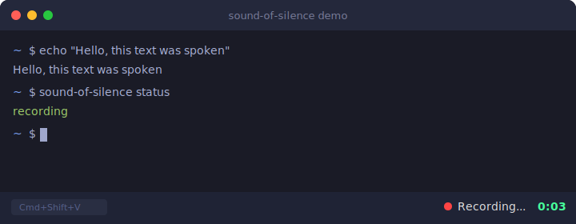
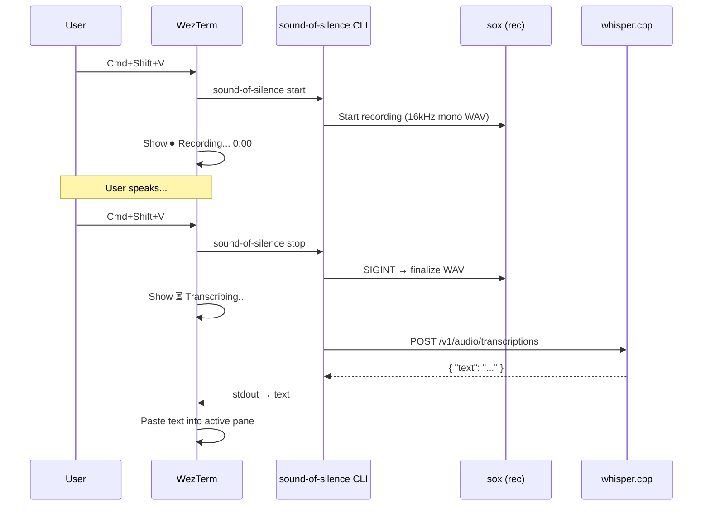

# Sound of Silence

Push-to-talk voice input for your terminal. Press a hotkey, speak, and your words appear as text — transcribed locally by [whisper.cpp](https://github.com/ggml-org/whisper.cpp).

No cloud APIs required. All speech processing happens on your machine.

<p align="center">
  
</p>

## How it works



1. Press **Cmd+Shift+V** to start recording — animated indicator appears in the status bar
2. Speak into your microphone
3. Press **Cmd+Shift+V** again to stop and transcribe
4. Transcribed text is typed into the active terminal pane
5. Press **ESC** at any time to cancel without transcribing

## Prerequisites

- **macOS** (uses sox for recording, Keychain for API keys)
- **[Homebrew](https://brew.sh/)** — the install script uses it to install dependencies
- **[WezTerm](https://wezfurlong.org/wezterm/)** — terminal emulator with Lua plugin support (`brew install --cask wezterm`)
- **[whisper.cpp](https://github.com/ggml-org/whisper.cpp)** server on port 2022 — or an OpenAI API key as fallback

## Installation

```bash
git clone https://github.com/ohade/sound-of-silence.git
cd sound-of-silence
./install.sh
```

The installer will:
- Install `sox` and `jq` via Homebrew (if not already installed)
- Symlink the CLI to `~/bin/`
- Symlink the WezTerm Lua module to `~/.config/wezterm/`
- Check if whisper.cpp is running and guide you if it's not

Then add two lines to your `~/.wezterm.lua` (if not already there):

```lua
local sos = require("sound-of-silence")
sos.apply(config)  -- before 'return config'
```

### Setting up whisper.cpp

The easiest way is via [VoiceMode](https://github.com/mbailey/voicemode):

```bash
pip install voice-mode
voicemode whisper install    # Downloads whisper.cpp + model
voicemode whisper start      # Starts server on port 2022
```

Or [build from source](https://github.com/ggml-org/whisper.cpp#quick-start). The server must be on port 2022.

## CLI Usage

The CLI works standalone (without WezTerm) for scripting and automation:

```bash
sound-of-silence              # Toggle: start or stop+transcribe
sound-of-silence start        # Start recording
sound-of-silence stop         # Stop and transcribe (outputs text to stdout)
sound-of-silence cancel       # Cancel recording (no transcription)
sound-of-silence status       # Print "recording" or "idle"
```

```bash
# Pipe transcription to clipboard
sound-of-silence stop | pbcopy

# Use in scripts
sound-of-silence start
sleep 5
TEXT=$(sound-of-silence stop)
echo "You said: $TEXT"
```

## WezTerm Plugin Options

```lua
-- Custom trigger key (Cmd+Shift+M instead of Cmd+Shift+V)
sos.apply(config, { key = "m" })

-- Custom script path
sos.apply(config, { script = "/custom/path/to/sound-of-silence" })
```

<details>
<summary>Advanced: manual setup for custom configs</summary>

If you already have custom keybindings or an `update-status` handler:

```lua
local sos = require("sound-of-silence")

-- Add keybindings to your existing keys table
sos.add_keybindings(config.keys)

-- In your update-status handler, guard against clearing the recording animation:
wezterm.on("update-status", function(window, pane)
  -- ... your existing logic ...
  if not wezterm.GLOBAL.sos_recording then
    window:set_right_status("")
  end
end)
```

</details>

## Configuration

| Variable | Default | Description |
|----------|---------|-------------|
| `STT_BASE_URL` | auto-detect | Whisper API endpoint (tries `localhost:2022`, falls back to OpenAI) |
| `SOS_LANGUAGE` | `en` | Transcription language ([ISO 639-1](https://en.wikipedia.org/wiki/List_of_ISO_639-1_codes)) |
| `SOS_MODEL` | `whisper-1` | Whisper model name |
| `SOS_REC_BIN` | auto-detect | Path to `rec` binary (from sox) |

### OpenAI API fallback

If no local whisper.cpp server is detected, the CLI falls back to the [OpenAI Whisper API](https://platform.openai.com/docs/guides/speech-to-text). The API key is read from macOS Keychain:

```bash
security add-generic-password -a "$USER" -s "openai-api-key" -w "sk-your-key-here"
```

## Troubleshooting

| Problem | Solution |
|---------|----------|
| `rec: command not found` | `brew install sox` |
| No local whisper.cpp and no OpenAI key | Start whisper.cpp or add key to Keychain (see above) |
| No sound captured | System Settings → Privacy → Microphone → grant terminal access |
| Whisper returns empty text | `curl http://localhost:2022/v1/models` — server may be down |
| WezTerm animation not showing | Ensure `sos.apply(config)` is called after `config.keys = { ... }` |

## License

MIT
